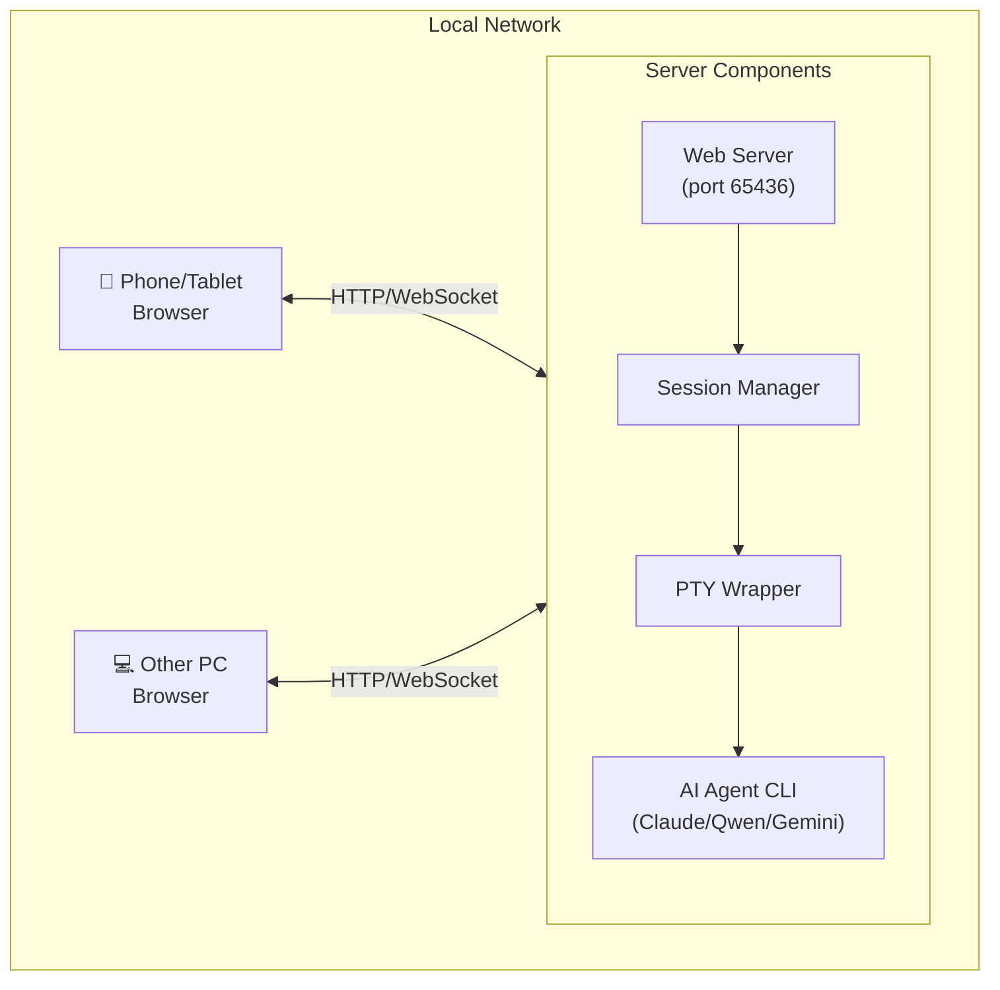

# Claude Remote Control

通过手机或桌面浏览器远程控制电脑上的 AI Agent CLI（Claude Code、Qwen、Gemini 等），实现随时随地与 AI 交互。

## 功能特点

- 🌐 手机/平板/桌面浏览器访问，无需安装 App
- 🖥️ 支持多种 AI Agent（Claude Code、Qwen、Gemini、OpenCode 等）
- 📂 多项目/多目录支持
- 🔐 Token 认证 + 密码保护
- 🌐 支持中转服务器部署（公网访问）

## 前提条件

- 电脑上已安装 AI Agent CLI（如 [Claude Code](https://claude.ai/code)、Qwen、Gemini 等）
- **手机/平板等终端需能与 AI Agent CLI 所在的电脑在同一局域网内直接通信**
  - 同一 WiFi 网络
  - 或通过 VPN/Tailscale 等方式可达
- 如需公网访问，请参考 [部署到公网](#部署到公网) 章节

## 网络拓扑



## 快速开始

### Windows 用户（推荐）

```powershell
# 1. 一键安装依赖
./install.ps1

# 2. 编辑配置文件
notepad config.json

# 3. 一键启动服务（后台运行）
./start.bat

# 4. 浏览器访问
# 本机测试: http://localhost:65436
# 其他设备: http://<本机IP>:65436 （如 http://192.168.1.100:65436）
```

> 查看本机 IP: `ipconfig` (Windows) 或 `ifconfig`/`ip a` (Linux/Mac)

### Linux / macOS 用户

```bash
# 1. 安装依赖
cd server && npm install && cd ..
cd client && npm install && cd ..

# 2. 配置
cp config.example.json config.json
# 编辑 config.json，设置 token 和 authPassword

# 3. 启动服务器
cd server && node claude-remote-server.js &

# 4. 启动 Session Manager（另一个终端）
cd client && node session-manager.js

# 5. 浏览器访问
# 本机测试: http://localhost:65436
# 其他设备: http://<本机IP>:65436
```

## 目录结构

```
claude-remote-control/
├── config.example.json   # 配置模板
├── config.json           # 配置文件（需自行创建，不提交到git）
├── server/               # 中转服务器
│   ├── claude-remote-server.js
│   ├── webapp/          # Web App
│   └── package.json
├── client/              # 桌面端程序
│   ├── claude-pty-wrapper.js
│   ├── session-manager.js
│   └── package.json
├── scripts/             # 管理脚本
├── doc/                 # 文档
└── deploy/              # 部署脚本
```

## 配置说明

### config.json

```json
{
  "aiAgents": {
    "claude": {
      "name": "Claude",
      "command": "claude --dangerously-skip-permissions",
      "fallbackPath": ""
    }
  },
  "server": {
    "host": "0.0.0.0",
    "port": 65436,
    "token": "YOUR_TOKEN_HERE",
    "authPassword": "YOUR_PASSWORD_HERE"
  },
  "session": {
    "maxHistory": 1000,
    "timeout": 3600000
  },
  "wrapper": {
    "defaultCols": 120,
    "defaultRows": 40
  }
}
```

**配置说明**:
- `aiAgents`: 支持的 AI Agent 列表
- `server`: 服务器配置（地址、端口、认证）
- `session`: 会话配置
- `wrapper`: 终端配置

## 部署到公网

### 方式一：使用部署脚本

```bash
cd deploy
# 先配置 .env（复制 .env.example）
./deploy-server.bat
```

### 方式二：手动部署

1. 上传 `server/` 目录到服务器
2. 安装依赖：`npm install`
3. 复制并配置 `config.json`
4. 使用 PM2 启动：

```bash
pm2 start claude-remote-server.js --name claude-remote
pm2 save
pm2 startup
```

### Nginx 反向代理（推荐）

```nginx
server {
    listen 80;
    server_name your-domain.com;

    location / {
        proxy_pass http://127.0.0.1:65436;
        proxy_http_version 1.1;
        proxy_set_header Upgrade $http_upgrade;
        proxy_set_header Connection "upgrade";
        proxy_set_header Host $host;
    }
}
```

## 常见问题

### Session Manager 无法启动 Wrapper

**解决**: Session Manager 必须在独立的终端窗口中运行，不能在 IDE 的终端中运行。

### 服务无法启动（提示 already running）

```bash
# 清理 lock 文件
rm *.lock
```

### Claude 路径错误

在 `config.json` 的 `aiAgents.claude.fallbackPath` 中配置正确的路径。

## 开发文档

详细文档请参考 [doc/DEVELOP.md](doc/DEVELOP.md)。

## License

MIT
