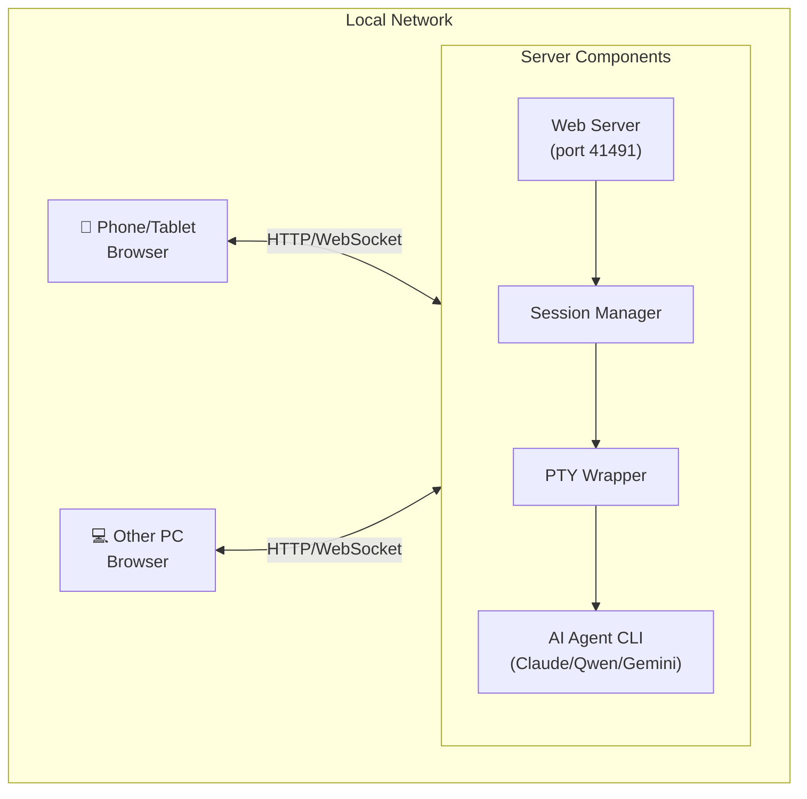

# AI Agent Remote

[简体中文](README.md) | English

Control AI Agent CLI (Claude Code, Qwen, Gemini, etc.) on your PC from mobile or desktop browser, interact with AI anytime, anywhere.

## Features

- 🌐 Mobile/Tablet/Desktop browser access, no App installation required
- 🖥️ Support multiple AI Agents (Claude Code, Qwen, Gemini, OpenCode, etc.)
- 📂 Multi-project/multi-directory support
- 🔐 Token authentication + password protection
- 🌐 Support relay server deployment (public network access)

## Prerequisites

- AI Agent CLI installed on your PC (e.g., [Claude Code](https://claude.ai/code), Qwen, Gemini, iFlow, OpenCode)
- **Mobile/Tablet must be able to communicate directly with the PC running AI Agent CLI in the same LAN**
  - Same WiFi network
  - Or accessible via VPN/Tailscale
- For public network access, refer to [Deploy to Public Network](#deploy-to-public-network)

## Network Topology



## Quick Start

### Windows Users (Recommended)

```powershell
# 1. Install dependencies
./install.ps1

# 2. Edit config file
notepad config.json

# 3. Start services (background mode)
./start.bat

# 4. Browser access
# Local test: http://localhost:41491
# Other devices: http://<YourIP>:41491 (e.g., http://192.168.1.100:41491)
```

> Check your IP: `ipconfig` (Windows) or `ifconfig`/`ip a` (Linux/Mac)

### Linux / macOS Users

```bash
# 1. Install dependencies
cd server && npm install && cd ..
cd client && npm install && cd ..

# 2. Configure
cp config.example.json config.json
# Edit config.json, set token and authPassword

# 3. Start server
cd server && node claude-remote-server.js &

# 4. Start Session Manager (another terminal)
cd client && node session-manager.js

# 5. Browser access
# Local test: http://localhost:41491
# Other devices: http://<YourIP>:41491
```

## Directory Structure

```
claude-remote-control/
├── config.example.json   # Config template
├── config.json           # Config file (create yourself, not committed to git)
├── server/               # Relay server
│   ├── claude-remote-server.js
│   ├── webapp/          # Web App
│   └── package.json
├── client/              # Desktop client
│   ├── claude-pty-wrapper.js
│   ├── session-manager.js
│   └── package.json
├── scripts/             # Management scripts
├── doc/                 # Documentation
└── deploy/              # Deployment scripts
```

## Configuration

### config.json

```json
{
  "aiAgents": {
    "claude": {
      "name": "Claude",
      "command": "claude --dangerously-skip-permissions",
      "fallbackPath": ""
    }
  },
  "server": {
    "host": "0.0.0.0",
    "port": 41491,
    "token": "YOUR_TOKEN_HERE",
    "authPassword": "YOUR_PASSWORD_HERE"
  },
  "session": {
    "maxHistory": 1000,
    "timeout": 3600000
  },
  "wrapper": {
    "defaultCols": 120,
    "defaultRows": 40
  }
}
```

**Configuration**:
- `aiAgents`: Supported AI Agent list
- `server`: Server configuration (address, port, authentication)
- `session`: Session configuration
- `wrapper`: Terminal configuration

## Deploy to Public Network

### Option 1: Use Deployment Script

```bash
cd deploy
# Configure .env first (copy from .env.example)
./deploy-server.bat
```

### Option 2: Manual Deployment

1. Upload `server/` directory to your server
2. Install dependencies: `npm install`
3. Copy and configure `config.json`
4. Start with PM2:

```bash
pm2 start claude-remote-server.js --name claude-remote
pm2 save
pm2 startup
```

### Nginx Reverse Proxy (Recommended)

```nginx
server {
    listen 80;
    server_name your-domain.com;

    location / {
        proxy_pass http://127.0.0.1:41491;
        proxy_http_version 1.1;
        proxy_set_header Upgrade $http_upgrade;
        proxy_set_header Connection "upgrade";
        proxy_set_header Host $host;
    }
}
```

## FAQ

### Session Manager fails to start Wrapper

**Solution**: Session Manager must run in a standalone terminal window, not in IDE's integrated terminal.

### Service fails to start (shows "already running")

```bash
# Clean up lock files
rm *.lock
```

### Claude path error

Configure the correct path in `config.json` at `aiAgents.claude.fallbackPath`.

## Security Recommendations

> ⚠️ **WARNING: Do NOT expose the service directly to the public internet!** Anyone could control your server, posing serious security risks.

### Cross-LAN Access Recommendations

For cross-LAN usage, set up a private virtual network:

- **Tailscale** (Recommended): https://tailscale.com - Free, easy-to-use, cross-platform
- **ZeroTier**: https://zerotier.com - Self-hosted controller support
- **WireGuard**: High-performance VPN solution

These tools create secure virtual LANs across different networks, providing the same experience as local LAN access.

### Firewall Configuration

**Windows Firewall**:
```powershell
# Allow specific IP access to port 41491
netsh advfirewall firewall add rule name="AI Agent Remote" dir=in action=allow protocol=tcp localport=41491 remoteip=192.168.1.0/24
```

**Linux iptables**:
```bash
# Allow specific IP only
iptables -A INPUT -p tcp --dport 41491 -s 192.168.1.0/24 -j ACCEPT
iptables -A INPUT -p tcp --dport 41491 -j DROP
```

### Other Security Measures

- **Change default Token and Password**: Set strong credentials in `config.json`
- **Rotate Token regularly**: Avoid using the same Token for extended periods
- **If public access is required**: Use HTTPS + Nginx reverse proxy with access control

## Development Documentation

For detailed documentation, see [doc/DEVELOP.md](doc/DEVELOP.md).

## License

MIT

## Disclaimer

This project is for learning and research purposes only. Use at your own risk.

- Do NOT expose the service directly to the public internet
- Users are responsible for configuring firewalls, VPNs, and other security measures
- The author is NOT responsible for any issues caused by improper security configuration
