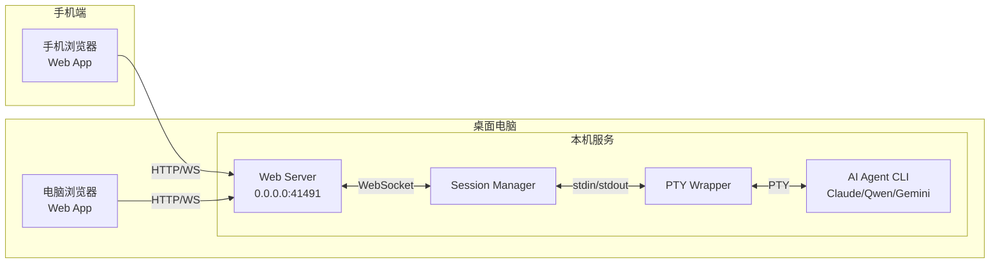

# Claude Remote Control 开发文档

> **端口**: 41491 (可在 config.json 中修改)

## 📋 目录
1. [快速开始](#一快速开始)
2. [核心设计](#二核心设计)
3. [目录结构](#三目录结构)
4. [配置管理](#四配置管理)
5. [进程管理](#五进程管理)
6. [相关文档](#六相关文档)

---

## 一、快速开始

```powershell
# 启动服务
.\scripts\restart-services.ps1

# 查看进程状态
.\scripts\manage-processes.ps1 -Action list

# 停止所有服务
.\scripts\manage-processes.ps1 -Action stop-all
```

访问: http://localhost:41491/app

## 二、核心设计

### 2.1 系统架构



**组件说明**:
- **Web App**: 浏览器端，提供终端界面 (xterm.js)
- **Web Server**: HTTP/WebSocket服务器，负责消息路由
- **Session Manager**: 会话管理，按需启动/停止Wrapper
- **PTY Wrapper**: 代理进程，与AI Agent CLI通信

### 2.2 消息协议

```json
// command - 发送命令 (mobile -> server -> wrapper)
{ "type": "command", "sessionId": "xxx", "data": { "content": "ls", "cols": 80, "rows": 24 } }

// output - CLI输出 (wrapper -> server -> desktop)
{ "type": "output", "sessionId": "xxx", "data": { "content": "..." } }

// resize - 调整终端大小 (mobile -> server -> wrapper)
{ "type": "resize", "sessionId": "xxx", "data": { "cols": 120, "rows": 30 } }

// status - 连接状态 (manager/server -> mobile)
{ "type": "status", "sessionId": "xxx", "data": { "status": "connected|disconnected" } }

// control - 控制消息 (认证、激活等)
{ "type": "control", "data": { "action": "auth|active", "deviceType": "desktop|mobile" } }
```

### 2.3 会话键设计

**格式**: `aiAgent:workDir`

示例: `claude:E:/MyCode/python`

同一目录下可运行多个AI CLI工具，互不干扰。

### 2.4 安全机制

**当前安全措施**:
- Token 认证：WebSocket 连接需提供有效 token
- Web 认证：/api/auth 接口用于登录

**潜在风险**:
- token 泄露后可被滥用
- 无 IP 白名单
- 无连接限流
- HTTP API 明文传输

**后续优化方向**:
- IP 白名单
- Token 定期更换
- 强制 HTTPS
- 连接数/频率限制

### 2.5 进程锁文件机制

- `server/server.lock` - 服务器进程锁
- `client/session-manager.lock` - Session Manager进程锁

启动时检查锁文件，防止服务多开。

## 三、网络架构

### 3.1 网络连接方式

项目支持多种网络连接方式：

**连接模式**:
- **局域网模式**（推荐）：通过局域网IP直连，低延迟
- **公网模式**（备用）：通过公网服务器中转，高可靠性

**网络拓扑**:
```
手机浏览器 ──► 局域网/公网 ──► 桌面电脑 Web Server
```

**优势**:
- 低延迟：局域网内延迟 ~5ms
- 高带宽：不经过中转服务器
- 简单性：无需配置复杂的内网穿透工具

### 3.2 配置说明

**config.json 配置**:
```json
{
  "connection": {
    "defaultMode": "direct",
    "fallbackToRelay": true
  }
}
```

**配置说明**:
- `connection.defaultMode`: 默认连接模式（direct/relay）
- `connection.fallbackToRelay`: 是否允许回退到中转模式

### 3.3 API 接口

#### 3.3.1 获取网络信息

```http
GET /api/network-info
```

返回:
```json
{
  "success": true,
  "data": {
    "localIp": "192.168.x.x",
    "connectionMode": "direct",
    "fallbackEnabled": true
  }
}
```

#### 3.3.2 获取 AI Agent 列表

```http
GET /api/ai-agents
```

返回:
```json
{
  "success": true,
  "data": {
    "claude": { "name": "Claude", "command": "claude", "fallbackPath": "..." },
    "qwen": { "name": "Qwen", "command": "qwen", "fallbackPath": "..." },
    "opencode": { "name": "OpenCode", "command": "opencode", "fallbackPath": "..." },
    "iflow": { "name": "iFlow", "command": "iflow", "fallbackPath": "..." },
    "gemini": { "name": "Gemini", "command": "gemini", "fallbackPath": "..." }
  }
}
```

#### 3.3.3 验证目录

```http
POST /api/validate-directory
Content-Type: application/json

{
  "directory": "E:/MyCode/python/my-project"
}
```

返回:
```json
{
  "success": true,
  "exists": true
}
```

## 四、目录结构

```
ai-agent-remote/
├── client/              # 客户端（桌面端）
│   ├── ai-agent-pty-wrapper.js    # PTY代理Wrapper
│   ├── session-manager.js        # 会话管理器
│   ├── session-manager.bat        # 启动脚本
│   └── package.json
├── server/              # 服务端
│   ├── ai-agent-server.js  # Web Server
│   ├── webapp/         # Web App
│   │   ├── index.html
│   │   ├── css/
│   │   └── js/
│   └── package.json
├── utils/               # 工具模块
│   └── config-loader.js  # 配置加载工具
├── scripts/             # 管理脚本
│   ├── check-logs.bat
│   ├── clean-reset.bat
│   ├── fix-network-stack.bat
│   ├── manage-processes.ps1
│   └── restart-services.ps1
├── doc/                # 文档目录
│   ├── DEVELOP.md
│   ├── TROUBLESHOOTING.md
│   └── QUICKSTART.md
├── deploy/              # 部署脚本
├── config.json          # 主配置文件
└── README.md
```

## 五、配置管理

### 5.1 配置文件结构

**config.json**:
```json
{
  "aiAgents": {
    "claude": {
      "name": "Claude",
      "command": "claude",
      "fallbackPath": "C:\\Users\\<username>\\.local\\bin\\claude.exe"
    },
    "qwen": {
      "name": "Qwen",
      "command": "qwen",
      "fallbackPath": "C:\\Users\\<username>\\AppData\\Roaming\\npm\\qwen.ps1"
    },
    "opencode": {
      "name": "opencode",
      "command": "opencode",
      "fallbackPath": "C:\\Users\\<username>\\AppData\\Roaming\\npm\\opencode.cmd"
    },
    "iflow": {
      "name": "iFlow",
      "command": "iflow",
      "fallbackPath": "C:\\Users\\<username>\\AppData\\Roaming\\npm\\iflow.cmd"
    },
    "gemini": {
      "name": "Gemini",
      "command": "gemini",
      "fallbackPath": "C:\\Users\\<username>\\AppData\\Roaming\\npm\\gemini.cmd"
    },
    "openclaw": {
      "name": "OpenClaw",
      "command": "openclaw tui",
      "fallbackPath": ""
    }
  },
  "server": {
    "host": "0.0.0.0",
    "port": 41491,
    "httpsPort": 41492,
    "url": "ws://localhost:41491",
    "token": "YOUR_AUTH_TOKEN",
    "authPassword": "YOUR_AUTH_PASSWORD"
  },
  "connection": {
    "defaultMode": "direct",
    "fallbackToRelay": true
  },
  "session": {
    "maxHistory": 1000,
    "timeout": 3600000
  },
  "wrapper": {
    "defaultCols": 120,
    "defaultRows": 40
  },
  "sessions": {
    "defaults": {},
    "overrides": {}
  }
}
```

### 5.2 配置加载

使用 `utils/config-loader.js` 统一加载配置：

```javascript
import { 
  getServerHost, 
  getServerPort, 
  getServerToken,
  getAIAgents,
  getSessionConfig,
  getConnectionConfig
} from '../utils/config-loader.js';
```

## 六、进程管理

### 6.1 管理脚本

所有管理脚本位于 `scripts/` 目录：

- **check-logs.bat** - 查看日志
- **clean-reset.bat** - 清理重置
- **fix-network-stack.bat** - 修复网络栈
- **manage-processes.ps1** - 进程管理
- **restart-services.ps1** - 重启服务

### 6.2 进程管理示例

```powershell
# 查看所有进程
.\scripts\manage-processes.ps1 -Action list

# 停止所有进程
.\scripts\manage-processes.ps1 -Action stop-all

# 停止服务器
.\scripts\manage-processes.ps1 -Action stop-server

# 停止Session Manager
.\scripts\manage-processes.ps1 -Action stop-manager

# 查看系统状态
.\scripts\manage-processes.ps1 -Action status

# 清理lock文件
.\scripts\manage-processes.ps1 -Action cleanup-lock
```

## 七、相关文档

- **[doc/TROUBLESHOOTING.md](TROUBLESHOOTING.md)** - 故障排查指南
- **[doc/QUICKSTART.md](QUICKSTART.md)** - 快速开始指南

---

## 八、更新日志

### v5.2 (2026-03-16)

**新功能**:
1. **配置管理页面** (`/admin`)
   - 独立的管理界面，用于系统配置管理
   - AI Agent 管理：查看预设/自定义 Agent，添加/编辑/删除自定义 Agent
   - 服务器配置：查看端口、Token 等配置（敏感信息脱敏）
   - 会话配置：查看会话超时、历史记录数等

**API 接口**:
- `GET /admin` - 管理页面
- `GET /api/admin/config` - 获取完整配置
- `GET /api/admin/ai-agents` - 获取 AI Agent 列表
- `POST /api/admin/ai-agents` - 添加 AI Agent
- `PUT /api/admin/ai-agents/:key` - 更新 AI Agent
- `DELETE /api/admin/ai-agents/:key` - 删除 AI Agent

### v5.1 (2026-03-16)

**修复问题**:
1. **终端滚动条美化** (`style.css`)
   - 问题：终端右侧垂直滚动条背景为白色，与深色主题不协调
   - 解决：添加 CSS 美化滚动条样式
   ```css
   #terminal .xterm-viewport::-webkit-scrollbar {
     width: 10px;
   }
   #terminal .xterm-viewport::-webkit-scrollbar-track {
     background: #1a1a1a;
   }
   #terminal .xterm-viewport::-webkit-scrollbar-thumb {
     background: #444;
   }
   ```

2. **新建标签验证问题** (`app.js`)
   - 问题：点击"+"新建标签时，服务器地址字段为空导致验证失败
   - 原因：字段只有 placeholder，没有默认值
   - 解决：服务器地址自动使用当前页面的 origin 转换为 ws 协议作为默认值
   ```javascript
   const serverUrl = this.elements.serverUrl.value.trim() || window.location.origin.replace(/^http/, 'ws');
   ```

---

*文档版本: 5.1*
*创建日期: 2026-03-11*
*更新日期: 2026-03-16*
*状态: 已实现*
